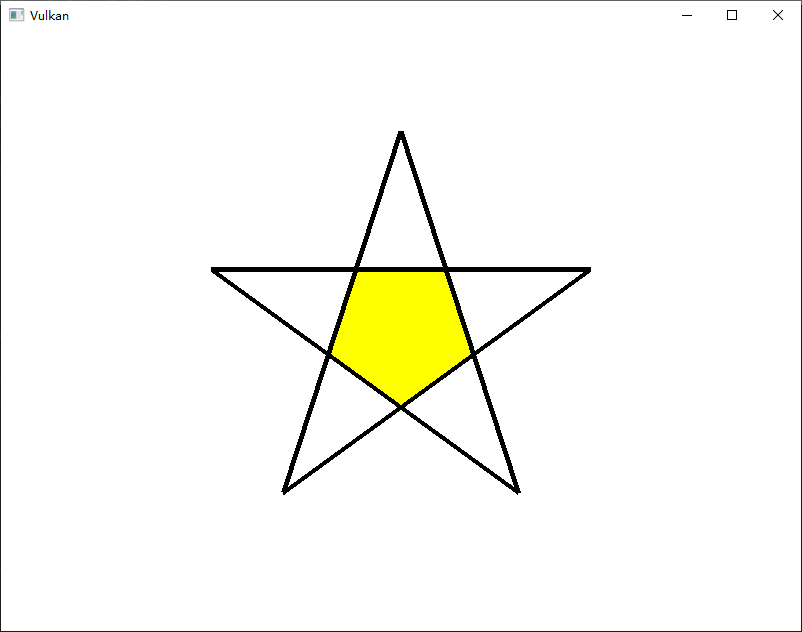
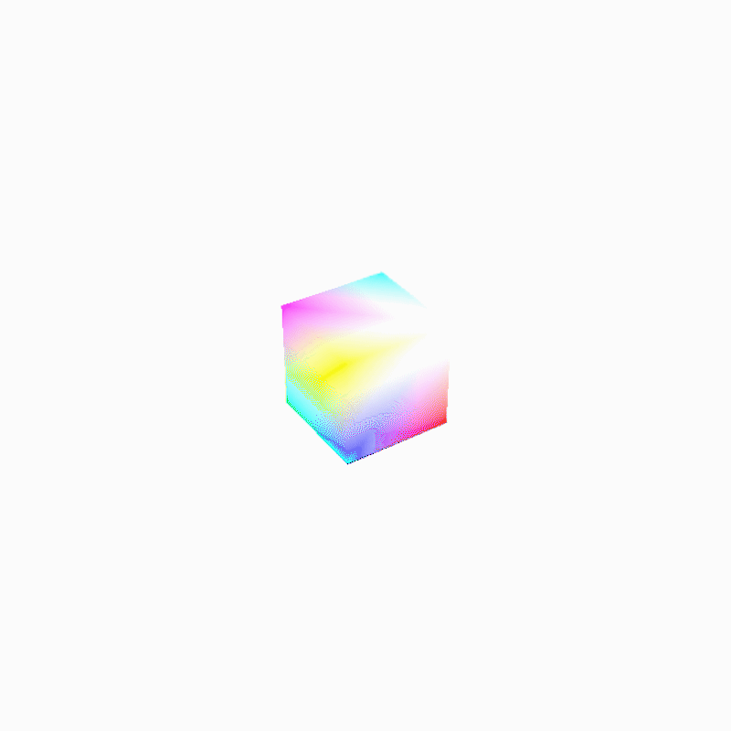
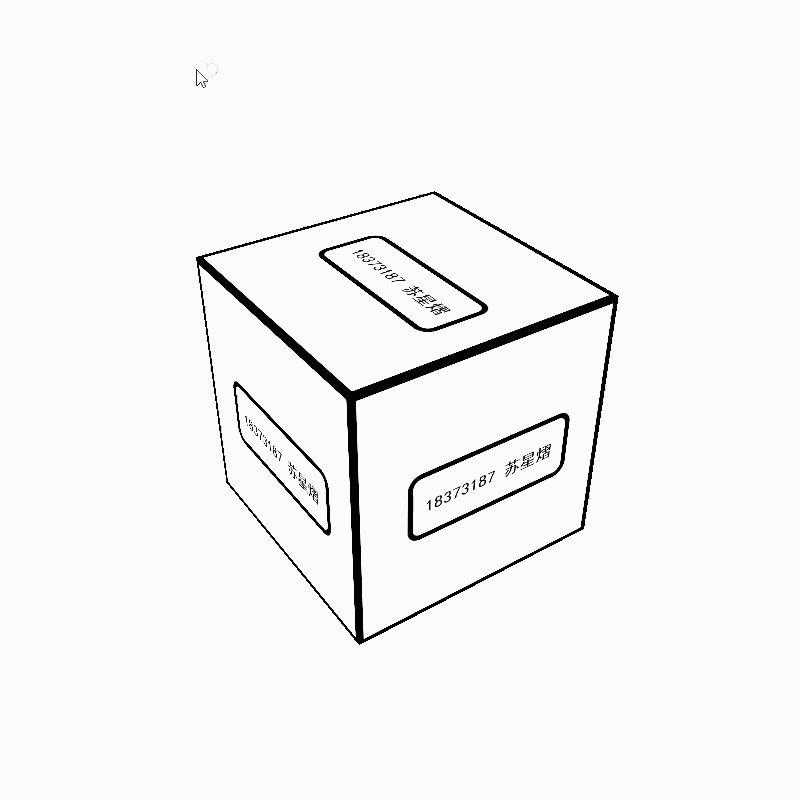

# 编程作业报告与说明

## 使用说明

### 生产环境

本次作业使用`vulkan`API进行编程，使用的IDE为`visual studio 2019 community`版本。提交文件中提供了`.sln`文件。

另外，由于`vulkan`并不提供默认的窗口组件，本次作业使用`glfw`库进行窗口渲染。

对于其他第三方库的使用，本次作业还使用了`stb`库，进行`.jpg`文件的加载；使用了`glm`库，使用其中的数据结构以及变换函数。

### 作业地址

本次作业使用`git`进行管理，其中不同次作业使用不同的分支保存。为保证`git`管理的正确性，欢迎老师从`github`仓库克隆作业代码：

https://github.com/SuXY-O-O/Vulkan-try

### 环境配置

尽管提供了`.sln`文件，其中对于`vulkan`以及`glfw`、`glf`库的引用配置可能跟随使用电脑进行更改。在这里给出`vulkan`官方提供的配置教程链接。

https://vulkan-tutorial.com/Development_environment

另一个`stb`库则在仓库中直接上传了源码，所以应当不存在引用问题。

### 作业运行

#### 运行

本次作业并没有被编译成为可执行文件，因此执行应在`visual studio`进行。

#### 不同任务

如前所述，作业使用`git`分支管理不同作业任务。

- `master`：管理指定任务三与四的部分内容；
- `star`：管理指定任务一的内容，绘制五角星；
- `box`：绘制彩色立方体并旋转；
- `texture`：在立方体上进行贴图（学号+姓名）。

使用时，若非必须，`master`分支展示了几乎作业的全部内容。

如果想要查看其他分支，请使用`git checkout <分支名>`。

作业完成情况在下方会有说明。

#### 特殊说明

主分支目前代码在**内存销毁**阶段存在一些问题，主要是部分'`vulkan`对象没有在程序结束时销毁。由于作业并不是让对API进行熟练使用，因此这类问题在最终版本中也没有解决。这个问题不影响程序执行，原因在于程序本身很小，而且问题只出在程序销毁过程。

当然除去主分支其他分支不存在这一问题。

#### 参数调整

非常抱歉本次作业的参数输入并没有进行更多的处理以方便更改，因此下方列举几个可能用到的需要调整的参数，参数只保证在`master`分支中出现。

具体列举方式为<参数意义>：<搜索内容>，<更改内容>，请使用者使用`ctrl+F`定位后进行修改。

- 递归细分曲面次数：在`main.cpp`中搜索`myball = new MyBall(WIDTH, HEIGHT,`，更改`MyBall`构造函数中最后一个参数（目前为4），参数意义为递归次数。
- 光源位置：在`main.cpp`中搜索`glm::vec3 lightPos =`，更改后面的三个参数，参数表示光源的三个坐标。
- 相机位置：在`main.cpp`中搜索`glm::vec3 camera =`，更改后面的三个参数，参数表示相机的三个坐标。
- 光照强度（材质变化）：在`main.cpp`搜索`// light strength`，更改下方三个参数，依次为：
  - `ubo.ambientStrength` 自发光强度（Phone光照中的第一项，可以理解为自发光）
  - `ubo.specularStrength` 镜面反射光强度
  - `ubo.diffuseStrength`漫反射光强度
  由于强度参数设置为全局，因此整个场景中所有物体材质统一。

## 作业完成情况说明

### 完成任务列表

| 指定任务号 |                           任务内容                           | 完成情况 |
| :--------: | :----------------------------------------------------------: | :------: |
|   任务一   |                   熟悉并创建绘图区域或窗口                   |    ✔     |
|   任务一   |                 以线框绘制一个平面五角星形状                 |    ✔     |
|   任务一   |                    填充五角星中间的五边形                    |    ✔     |
|   任务二   |                    绘制一个三维彩色立方体                    |    ✔     |
|   任务二   |                       让立方体自动旋转                       |    ✔     |
|   任务二   |                       五角星旋转立起来                       |    ✔     |
|   任务三   |                 利用递归细分绘制一个三维球面                 |    ✔     |
|   任务三   |           将五角星、立方体和球体的中心沿某条线排列           |    ✔     |
|   任务三   |                 三个对象都放置到视景体中可见                 |    ✔     |
|   任务三   |                    投影方式设置为透视投影                    |    ✔     |
|   任务三   |        开启光照，体会不同光照和材质设置带来的效果变化        |    ✔     |
|   任务三   |                 至少绘制出一个物体的阴影效果                 | 下方说明 |
|   任务四   | 将学号和姓名制作成一张贴图图片，将该图片作为纹理映射到某个物体上 |    ✔     |
|   任务四   |           立方体上设置环境贴图，反射出五角星的形状           |    ✘     |

### 具体说明

- 打勾的任务为明确完成并且个人认为达到了作业要求。

- 任务三中绘制阴影任务，尽管加入了相关代码，但是绘制效果并没有出现，可能的问题有两个：矩阵的变换与预计不符，或者是对于显存的使用出现问题。

  尽管我查询了很久，并没有发现矩阵变换逻辑上的明显不正确。因此问题更可能是出在了显存使用上。但由于对于`vulkan`的熟悉程度不足，我实在无能为力。

- 任务四绘制环境贴图任务，由于任务三阴影贴图都没有完成，就没有再继续进行。

- 希望老师**不要**认为我是因为**懒**才没有完成以上两个任务。我有阅读过上届同学使用`openGL`书写的代码，完成最终任务也只使用了350行代码。然而`vulkan`绘制一个三角形就需要使用900行代码。

- `vulkan`最终的屏幕坐标与`openGL`的映射方式不尽相同，大概就是Z轴坐标范围是0到1而不是-1到1，Y轴会上下翻转。尽管说出来简单，但这导致了很多行为不正常的地方，因为在变换矩阵时使用的还是`openGL`的变换API。

## 代码说明与实现思路

### 代码说明

#### 会出现重复的代码

我需要承认大部分代码都从教程中获得。教程观看的`vulkan`的官方教程，即之前环境配置时提供的链接。

与官方教程重复的代码基本在`main.cpp`中；

此外`linmath.h`整个内容全部为复制，但是真正实现过程中我并没有使用这个头文件，如需测试可以直接删除该文件以及相关代码来测试（部分文件可能引入的该头文件，但是没有使用其中的函数）。

尽管老师说”根据代码自己修改变量重写一遍也可以“，但我着实连变量名也不太敢修改。观察`main.cpp`可以发现，其中大量变量都是`vulkan`定义的结构体，以及用于构建`vulkan`结构体、为结构体分配内存的信息结构体，并且大量结构体只会出现一次或者在一个命名空间内只出现一次。因此官方教程的命名习惯其实基本可以对应到所有人的命名习惯——驼峰命名，结构体名首字符大写，变量首字符小写。因此我也没有再特意去改变量名，但我保证代码的自行完成性质。

另外，其实`main.cpp`与官方代码也有很大差距，差距最大在于官方教程中使用了`instance`来告知程序每个模型送人顶点着色器的顺序——因为根据目前的设置，管线会认为顶点序列中每三个顶点为一个三角形，这必然会让顶点重复送入管线，因此用到了`instance`。而在我的程序中没有使用该参数，原因是模型都很简单，可以显式地组织数据，顶点重复多次也不会导致内存不足。

#### 自己书写的代码

- `MyModel`：自己书写的模型，包括三角形、五角星、立方体和球体。
- `MyTool`：自己书写的旋转与平移变换函数，在CPU上进行变换。
- `MyVertex`：定义的传入顶点的内存组织方式。
- `shaders`文件夹：`glsl`的着色器语言文件，包括主流水线、阴影流水线的顶点着色器和片元着色器。

这几部分为完全独立书写。

### 实现思路

#### 光照

使用`Phone`光照算法，把光照拆解成为3部分：自发光、镜面反射、漫反射。通过设置后两者的反射强度来调整材质感觉。

#### 阴影

使用阴影贴图，首先在灯光坐标系下渲染出深度图，把深度图送入主流水线来决定阴影位置。

这个部分如前所述没有实现，最有可能问题在于获取深度图失败。

#### 环境贴图

从相机视角发出射线到达对应物体，在物体表面进行镜面反射与漫反射，之后到环境中寻找涉嫌到达位置的颜色，生成颜色贴图，之后传入主流水线进行绘制。

这个部分没有实现。

## 效果展示

- 渲染出的五角星。

- 旋转的彩色立方体。

- 立方体贴图。

- 按中心排列
- 五角星旋转
- 开启光照，设置材质
- 绘制球体
- 透视

